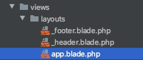

#### 构建基础页面

&emsp;&emsp; 前端能力稍微有点有限😌，但是我还是要记录一下开发过程。

1. 修改配置：在本地的话，我们默认配置项是放到 `.env`文件的开始的时候没有这个文件，直接把`.env.example`直接`copy` 一份，copy 完进行一下简单的配置就好了，这里就不多说了什么数据库呀、app_name、APP_KEY、APP_URL进行配置就好了。

2. 辅助函数：顾名思义，辅助开发的全局函数。我在这里定义的函数主要实现是将类名转换成CSS的类名。

3. 开始先构建基础文件 主要是三个文件 `app`、`_footer`、`_header`  通过命名也知道文件里面放的内容，这样做有什么好处呢？ 可以想一下 `_footer` 和  `_header` 基础页面是是几乎所有的页面都要有的 稍后我们 包含就可以用了。但是这时候可能有杠精同学要问了。我直接复制不就可以了，首先这个想法是对的，确实可以那样做。但是这会带来一个问题。如果页面变的非常非常多你需要修改 `_header`中的某一项 是不要要修改每一个文件，有的时候还可能会漏掉。这个时候这样做的方便之处就体现出来了。 

   
   
4. 解决浏览器缓存问题，在发生静态文件改变的时，加入一个随机的字符串。每次改变连接的字符串就会改变便能够防止缓存问题。

